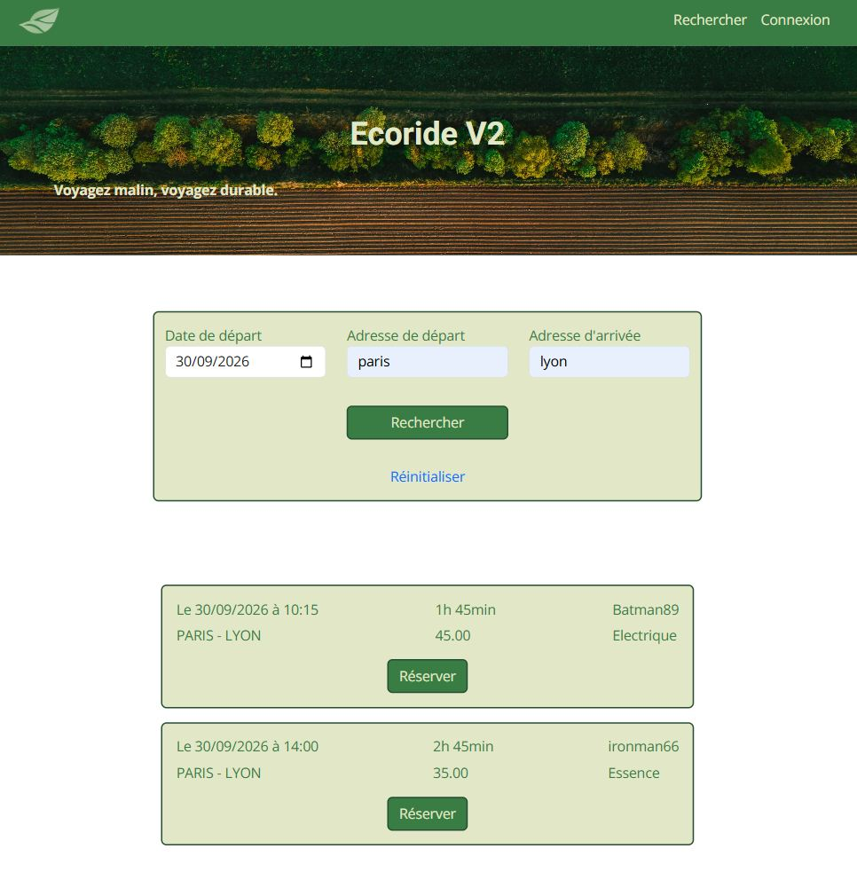

# Ecoride V2

## 1. Description du projet

**Ecoride V2** est une application web de covoiturage qui privilégie l'utilisation de véhicules à faible empreinte écologique. Elle permet aux utilisateurs de rechercher et de proposer des trajets, de gérer leur profil et d'interagir avec la plateforme selon leur rôle (*Passenger*, *Driver*, *Employee* ou *Admin*). 
> **Note :** Il s'agit de la version sous framework (Symfony) du projet initialement présenté lors de mon examen.

---

## 2. Technologies utilisées

### **Front-End**

- HTML5
- CSS3 & Sass
- Bootstrap
- Approche mobile-first

### **Back-End**

#### Langage & Framework

- PHP 8.4
- Symfony 7.4

#### Gestion des données

- Doctrine ORM
- Doctrine Migrations
- Doctrine Fixtures

#### Sécurité

- Symfony Security Bundle
- Password Hasher
- Reset Password Bundle
- Verify Email Bundle

#### Templates & formulaires

- Twig
- Symfony Form
- Symfony Validator

#### Symfony UX (Front-End dynamique)

- Stimulus
- Turbo / Hotwire
- Twig Components

#### Gestion des assets Front-End

- Symfony AssetMapper

#### Services supplémentaires

- Symfony Mailer
- Symfony HTTP Client
- Symfony Maker Bundle

### **Base de données**

- **PostGreSQL** : gestion des entités principales (utilisateurs, voitures, trajets et réservation).

---

## 3. Environnement de travail

- IDE : VS Code avec extensions PHP Intelephense et Prettier.
- Serveur local : Docker.
- Versionning : Git & GitHub.

---

## 4. Sécurité

- Authentification via Symfony Security
- Gestion des rôles (Visiteur, Employé, Administrateur)
- Hashage automatique des mots de passe via le composant Security
- Système sécurisé de réinitialisation de mot de passe (Reset Password)
- Protection CSRF sur les formulaires
- Validation des données avec Symfony Validator

---

## 5. Fonctionnalités principales

### Visiteur

- Rechercher et filtrer des trajets
- Consulter les détails d’un trajet

### Passager

- Réserver un trajet
- Gérer ses réservations
- Gérer son profil utilisateur

### Conducteur

- Proposer un nouveau trajet
- Gérer ses trajets
- Gérer les informations de son/ses véhicules

### Employé

- Gérer les trajets signalés


### Administrateur

- Gérer les utilisateurs

---

## 6. Aperçu de l'application

### Page d’accueil


### Page de recherche de trajet disponible



## 7. Installation

### 1. Cloner le dépôt dans un dossier:

```bash
 git clone https://github.com/Delphine2004/Ecoride_v2.git
```

### 2. Se déplacer dans le dossier puis copier le fichier d’exemple des variables d’environnement :

```bash
cp .env.example .env
```

Modifier les mots de passe dans le fichier .env si nécessaire.

### 3. Construire et lancer les conteneurs :

```bash
docker compose up -d --build
```


### 4. Créer la base de donnée :

Rentrer dans le conteneur php

```bash
docker compose exec php bash
```

Exécuter les migrations

```bash
php bin/console doctrine:migrations:migrate
```

### 5. Générer les données :

Toujours dans le conteneur php

```bash
php bin/console doctrine:fixtures:load
```

L’application accessible : http://localhost:8094

MailHog accessible : http://localhost:8025

(Adapter les ports en fonction du fichier .env. si modifiés)

### 6. Comptes de test

Après exécution des fixtures, les comptes suivants sont disponibles :

- Administrateur  
  Email : admin@ecoride.fr  

- Employé  
  Email : staff@ecoride.fr  

- Passagers  
  Emails: hermione@poudlard.com, bond007@mi6.co.uk

- Conducteurs  
  Emails: batman@batman.com, superman@dailyplanet.com,  ironman@starkindustries.com, spiderman@bugle.com

  Mots de passe : `Azertyuiop12*`  
(Les mots de passes sont identiques pour tous les comptes. Ceci n'est évidemment pas une bonne pratique.)
---
## 8. Améliorations futures

- Tableau de bord statistiques pour l'administrateur
- Ajout de la géolocalisation


## 9. Auteur

Projet développé par Delphine FUMEX

- GitHub : https://github.com/Delphine2004
- LinkedIn : https://www.linkedin.com/in/delphine-fumex/
- Portfolio: https://delphinefumex.com
